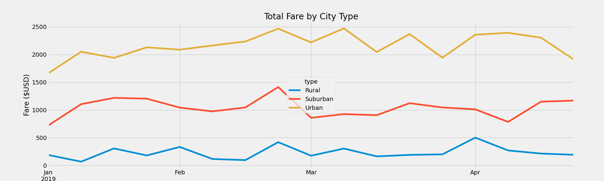

# PyBer_Challenge
## Overview of the analysis:
The purpose of this analysis to breakdown the city and ride data file and present the data to the descision makers to view how fares are effected by city type over a 4 month period.
## Results:
There are 3 city type rural, suburban, and urban. The resulsts show that there are more rides had in urban areas than in rural areas. However on average drivers in rural areas make more per ride than those in urban areas. The graph below shows the sum of the fares in USD over a three month period. 

## Summary:
In summary I would decrease the number of drivers in urban areas. This will increase the average fare per driver in that area. I would also decrease the number of drivers in rural areas as well. There are to many drives for the amount of rides given. One more suggestion would be to up the fares for urban areas as on average lower than suburban and rural areas. 
